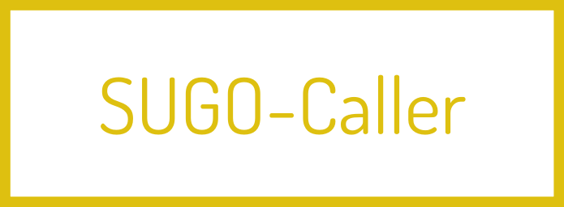
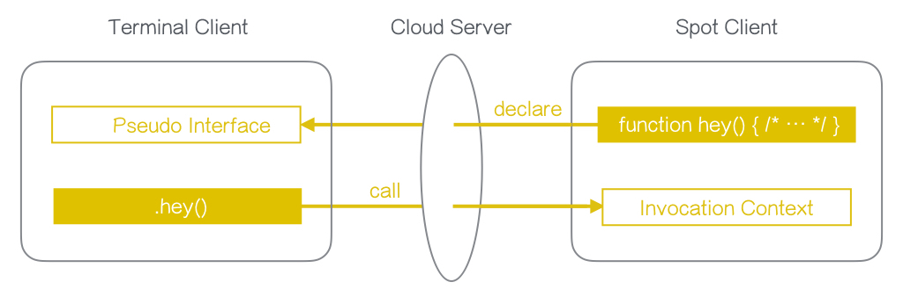
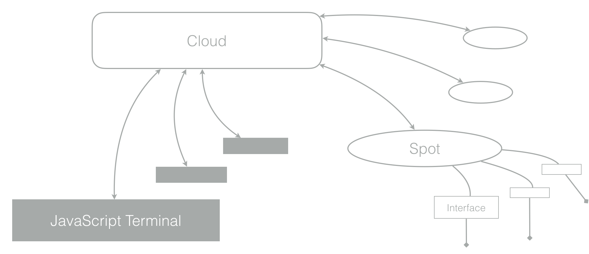

sugos-assets
==========

<!---
This file is generated by ape-tmpl. Do not update manually.
--->

<!-- Badge Start -->
<a name="badges"></a>

[![Build Status][bd_travis_com_shield_url]][bd_travis_com_url]
[![npm Version][bd_npm_shield_url]][bd_npm_url]
[![JS Standard][bd_standard_shield_url]][bd_standard_url]

[bd_repo_url]: https://github.com/realglobe-Inc/sugos-assets
[bd_travis_url]: http://travis-ci.org/realglobe-Inc/sugos-assets
[bd_travis_shield_url]: http://img.shields.io/travis/realglobe-Inc/sugos-assets.svg?style=flat
[bd_travis_com_url]: http://travis-ci.com/realglobe-Inc/sugos-assets
[bd_travis_com_shield_url]: https://api.travis-ci.com/realglobe-Inc/sugos-assets.svg?token=aeFzCpBZebyaRijpCFmm
[bd_license_url]: https://github.com/realglobe-Inc/sugos-assets/blob/master/LICENSE
[bd_codeclimate_url]: http://codeclimate.com/github/realglobe-Inc/sugos-assets
[bd_codeclimate_shield_url]: http://img.shields.io/codeclimate/github/realglobe-Inc/sugos-assets.svg?style=flat
[bd_codeclimate_coverage_shield_url]: http://img.shields.io/codeclimate/coverage/github/realglobe-Inc/sugos-assets.svg?style=flat
[bd_gemnasium_url]: https://gemnasium.com/realglobe-Inc/sugos-assets
[bd_gemnasium_shield_url]: https://gemnasium.com/realglobe-Inc/sugos-assets.svg
[bd_npm_url]: http://www.npmjs.org/package/sugos-assets
[bd_npm_shield_url]: http://img.shields.io/npm/v/sugos-assets.svg?style=flat
[bd_standard_url]: http://standardjs.com/
[bd_standard_shield_url]: https://img.shields.io/badge/code%20style-standard-brightgreen.svg

<!-- Badge End -->


<!-- Description Start -->
<a name="description"></a>

Asset file generator

<!-- Description End -->


<!-- Overview Start -->
<a name="overview"></a>


<!-- Overview End -->


<!-- Sections Start -->
<a name="sections"></a>

<!-- Section from "doc/guides/01.Installation.md.hbs" Start -->

<a name="section-doc-guides-01-installation-md"></a>
Installation
-----

```bash
$ npm install sugos-assets --save
```


<!-- Section from "doc/guides/01.Installation.md.hbs" End -->

<!-- Section from "doc/guides/02.Usage.md.hbs" Start -->

<a name="section-doc-guides-02-usage-md"></a>
Usage
---------

```javascript
'use strict'

const sugosAssets = require('sugos-assets')
const co = require('co')

co(function * () {
  // Generate favicon for an example project
  {
    const type = 'example'
    const filename = 'doc/images/my-example-01-favicon.svg'
    yield sugosAssets.favicon(type, filename, {
      // Render config
      name: 'my-example-01',
      color: '#38A'
    })
  }
}).catch((err) => console.error(err))

```


<!-- Section from "doc/guides/02.Usage.md.hbs" End -->

<!-- Section from "doc/guides/03.Assets.md.hbs" Start -->

<a name="section-doc-guides-03-assets-md"></a>
Assets
-----

**Images**

| Image | Path |
| ----- | ---- |
|  | [assets/images/mac-banner.svg](assets/images/mac-banner.svg) |
|  | [assets/images/nodejs-banner.png](assets/images/nodejs-banner.png) |
|  | [assets/images/npm-banner.png](assets/images/npm-banner.png) |
|  | [assets/images/sugo-actor-banner.png](assets/images/sugo-actor-banner.png) |
|  | [assets/images/sugo-caller-banner.png](assets/images/sugo-caller-banner.png) |
|  | [assets/images/sugo-cloud-banner.png](assets/images/sugo-cloud-banner.png) |
|  | [assets/images/sugo-observer-banner.png](assets/images/sugo-observer-banner.png) |
|  | [assets/images/sugos-banner.png](assets/images/sugos-banner.png) |
|  | [assets/images/sugos-favicon.png](assets/images/sugos-favicon.png) |
|  | [assets/images/sugos-overview.jpeg](assets/images/sugos-overview.jpeg) |
|  | [assets/images/sugos-structure.png](assets/images/sugos-structure.png) |


<!-- Section from "doc/guides/03.Assets.md.hbs" End -->


<!-- Sections Start -->


<!-- LICENSE Start -->
<a name="license"></a>

License
-------
This software is released under the [MIT License](https://github.com/realglobe-Inc/sugos-assets/blob/master/LICENSE).

<!-- LICENSE End -->


<!-- Links Start -->
<a name="links"></a>

Links
------

+ [sugos][sugos_url]

[sugos_url]: https://github.com/realglobe-Inc/sugos

<!-- Links End -->
